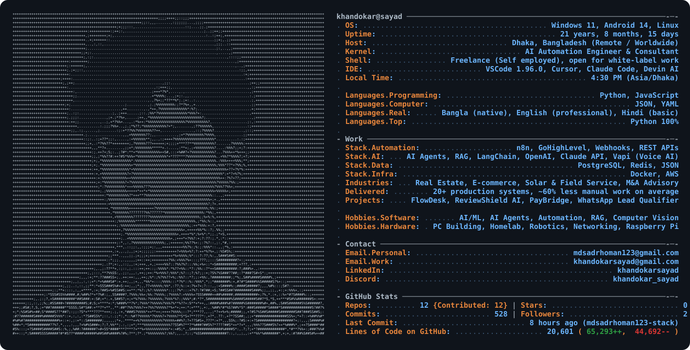
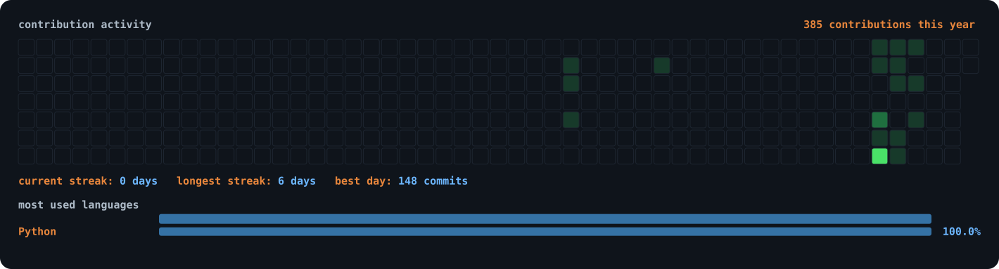

<picture>
  <source media="(prefers-color-scheme: dark)" srcset="./dark_mode.svg" />
  <source media="(prefers-color-scheme: light)" srcset="./light_mode.svg" />
  
</picture>

 

  
  
  
  
  
  
  

Sayad is an <strong>AI Automation Engineer and consultant</strong> working with <a href="https://n8n.io">n8n</a>, AI agents, RAG pipelines and CRM automation. He builds production systems for teams in <strong>Real Estate, E-commerce, Solar & Field Service and M&A Advisory</strong> currently expanding into Healthcare & Dental-white-label for agencies and directly with founders. His builds ship with explicit <strong>error handling, retry logic, SLA tracking and audit trails</strong> from day one, because most automation does not fail with an alarm: it fails silently. To date <strong>20+ production systems</strong> delivered, cutting manual work by <strong>~60% on average</strong>. Open worldwide for remote freelance and white-label projects — reach him on <a href="https://www.linkedin.com/in/khandokarsayad">LinkedIn</a>.

 

---

 

  
  
  
  
  
  
  
  
  
  
  
  
  
  
  
  
  
  
  
  
  
  
  
  
  
  
  

<!-- contribution snake, generated by .github/workflows/snake.yml -->
<picture>
  <source media="(prefers-color-scheme: dark)" srcset="https://raw.githubusercontent.com/mdsadrhoman123-stack/mdsadrhoman123-stack/output/snake-dark.svg" />
  
</picture>

💬 If your team repeats the same work every day, message me with the process — I'll tell you which part I'd automate first, and which part I wouldn't.
